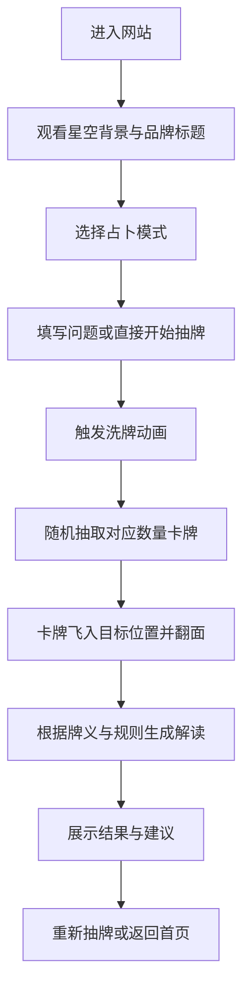

## 1. 产品概述
“星语雷诺曼”是一个纯前端单页在线占卜网站，围绕雷诺曼 36 张卡牌构建沉浸式抽卡与解读体验，以深空星空、玻璃拟态和动态动画营造神秘优雅的仪式感。

- 目标用户为对塔罗 / 雷诺曼 / 神秘学风格产品感兴趣、希望快速获得轻量占卜反馈的普通访客。
- 产品价值在于以低门槛、强氛围、强互动的方式提供多种占卜模式，并通过高完成度视觉体验提升停留与分享意愿。

## 2. 核心功能

### 2.1 功能模块
1. **首页**：品牌标题、动态星空背景、四个占卜入口、氛围化介绍文案。
2. **今日运势**：单张牌抽取、洗牌动画、翻牌展示、模板化运势解读。
3. **是 / 否占卜**：问题输入、两张牌展示、基于牌组倾向的 Yes / No 判断与组合解读。
4. **二选一占卜**：问题描述、选项 A / B 输入、左右牌阵对比、建议倾向输出。
5. **事件趋势**：过去 / 现在 / 未来三张时间线牌阵、逐步翻牌与趋势总结。
6. **占卜历史（可选）**：将近期占卜记录保存至本地 `localStorage`，支持再次查看。
7. **静态部署支持**：输出完整可运行前端代码，能够直接部署到 Vercel、Netlify 与 Cloudflare Pages。

### 2.2 页面详情
| 页面名称 | 模块名称 | 功能描述 |
|-----------|-----------|-----------|
| 单页首页 | 星空背景 | 全屏 Canvas 2D 渲染深空渐变、闪烁星点、随机流星，作为全站动态背景 |
| 单页首页 | 品牌区 | 居中显示“星语雷诺曼”标题、副标题和淡入动画，建立神秘沉浸氛围 |
| 单页首页 | 功能入口卡片 | 提供“今日运势 / 是否占卜 / 二选一 / 事件趋势”四张 glassmorphism 风格入口卡片，移动端保持 2x2 网格 |
| 今日运势视图 | 洗牌区 | 点击开始后触发牌堆扇形展开再收拢动画，随后抽出 1 张牌 |
| 今日运势视图 | 翻牌展示 | 被选中的卡牌飞入展示区并进行 3D 翻转，显示牌名、关键词、牌义 |
| 今日运势视图 | 解读面板 | 使用前端模板生成“今日运势”文案，强调当天提示与建议 |
| 是 / 否占卜视图 | 问题输入 | 多行文本输入问题，限制 100 字，提供输入状态提示 |
| 是 / 否占卜视图 | 双牌结果 | 抽取并展示 2 张牌，按顺序翻开，完成 Yes / No 倾向计算 |
| 是 / 否占卜视图 | 组合解读 | 根据两张牌的正负面倾向和中性组合生成判断与说明 |
| 二选一视图 | 表单输入 | 输入问题描述、选项 A、选项 B，校验非空后开始抽牌 |
| 二选一视图 | 双侧牌阵 | 为 A/B 各抽取 3 张牌并左右并排展示，可降级为各 1 张的简化模式 |
| 二选一视图 | 结果建议 | 基于正向牌数量、核心关键词与整体氛围输出建议倾向 |
| 事件趋势视图 | 时间线牌阵 | 过去 / 现在 / 未来三张牌横向排列，依次翻牌并附带位置说明 |
| 事件趋势视图 | 总结区域 | 汇总三张牌的串联含义，输出对未来趋势的整体建议 |
| 全局 | 历史记录 | 记录占卜类型、问题、结果与时间戳，供用户本地回看 |
| 全局 | 静态部署兼容 | 生成的站点不依赖后端接口，构建结果为纯静态资源，可直接托管 |
| 全局 | 导航返回 | 在各功能视图提供返回首页或重新抽牌能力 |

### 2.3 牌组数据要求
网站内置完整 36 张雷诺曼牌组数据，每张牌包含以下字段：

- `id`
- `name`（中文名）
- `nameEn`（英文名）
- `keywords`（关键词数组）
- `meaning`（正位含义）
- `image`（使用 SVG / CSS 绘制的符号化视觉）
- `polarity`（建议新增：`positive` / `neutral` / `negative`，便于判断逻辑）
- `symbol`（建议新增：用于卡面中央图案渲染）

补全牌组中的第 36 张为：**鱼（Fish）**。

牌面图形必须使用 **CSS / SVG / 文字符号绘制**，不得依赖外部图片资源。

### 2.4 解读逻辑
1. **今日运势**
   - 抽取 1 张牌。
   - 使用模板生成文案，例如：“今日{牌名}出现，意味着{meaning}。关键词围绕{关键词}展开，适合你在今天特别留意相关讯号。”

2. **是 / 否占卜**
   - 抽取 2 张牌。
   - 正向牌：太阳、三叶草、心、钥匙、星星、鹳、花束、孩子。
   - 负向牌：棺材、镰刀、十字架、云、蛇、山、老鼠、狐狸。
   - 规则：
     - 两正向：结果偏 **Yes**
     - 两负向：结果偏 **No**
     - 一正一负 / 双中性：结果偏 **需要更多观察**
     - 若组合中出现“钥匙 / 太阳 / 星星”等高确定性牌，可增强 Yes 倾向
     - 若组合中出现“棺材 / 十字架 / 山”等强阻滞牌，可增强 No 倾向

3. **二选一占卜**
   - 默认每个选项抽取 3 张牌。
   - 比较 A/B 两侧牌阵的正向牌数量、阻碍牌数量、关键词整体氛围。
   - 输出“更倾向 A / 更倾向 B / 两者都需谨慎观察”。

4. **事件趋势**
   - 抽取 3 张牌，分别代表过去 / 现在 / 未来。
   - 每张牌结合位置语义生成独立解释。
   - 最终生成一段整体时间线总结。

## 3. 核心流程
用户进入网站后，先被动态星空与品牌标题吸引，再从四种占卜模式中选择一种进入。用户完成输入（如问题、选项）后触发洗牌与抽牌动画，系统从本地牌组中随机抽取卡牌并进行逐张翻牌，同时基于预设规则生成解读结果。用户可选择重新抽牌、切换其他模式，或查看本地历史记录。



## 4. 用户界面设计

### 4.1 设计风格
- **整体风格**：深空星空、神秘优雅、仪式感强的沉浸式占卜室体验
- **主背景色**：`#0a0a1a`
- **主文字色**：`#e0e0e0`
- **强调色**：星尘金 `#d4af37`
- **辅助色**：月光银 `#c0c0d0`、神秘紫 `#9b59b6`
- **面板风格**：glassmorphism，包含半透明背景、`backdrop-blur`、微弱金紫描边、柔和发光
- **标题字体**：Google Fonts `Cinzel`
- **正文字体**：Google Fonts `Inter`
- **按钮样式**：圆角胶囊 / 圆角矩形，悬浮时叠加渐变高光和外发光，点击时 `scale(0.95)`
- **图标风格**：星体、月亮、钥匙、天秤等轻装饰化符号，避免卡通感
- **文案语言**：所有用户可见文案必须为中文
- **代码注释**：组件与逻辑中的注释统一使用中文

### 4.2 页面设计概览
| 页面名称 | 模块名称 | UI 元素 |
|-----------|-----------|-----------|
| 单页首页 | 背景层 | 全屏深空渐变 + Canvas 星空粒子 + 偶发流星 |
| 单页首页 | 标题区 | 大号标题、淡入动效、微发光描边、细颗粒氛围光斑 |
| 单页首页 | 模式入口 | 2x2 卡片矩阵，卡片具玻璃拟态、悬浮上浮和辉光反馈 |
| 功能视图 | 卡牌区 | 中央牌堆 / 目标牌阵布局，支持桌面宽屏与移动端紧凑排布 |
| 功能视图 | 解读面板 | 半透明高光边框面板，文字支持逐行淡入 |
| 功能视图 | 输入区 | 深色半透明输入框，聚焦时边框转为金紫渐变光 |
| 全局 | 装饰层 | 微粒子漂浮、星轨弧线、柔和晕染光团、局部噪点纹理 |

### 4.3 响应式策略
- 采用**桌面优先**设计，兼容移动端自适应。
- 桌面端重点展示沉浸背景、左右对称排版、宽松留白，卡牌尺寸为 `120px x 200px`。
- 平板端卡牌尺寸为 `100px x 170px`。
- 手机端卡牌尺寸缩小至 `90px x 150px`，首页功能入口保持 `2x2` 网格。
- 手机端“事件趋势”时间线牌阵由横向排列改为纵向排列。
- 交互目标需适配触控，按钮高度不低于 44px。

### 4.4 动效规范
- **洗牌动画**：牌组扇形展开再收拢，总时长约 `1.5s`
- **翻牌动画**：基于 `transform-style: preserve-3d` 和 `perspective`，时长 `0.8s`，缓动 `cubic-bezier(0.4, 0, 0.2, 1)`
- **飞牌动画**：抽中的牌从牌堆飞向目标位置，伴随 `scale` 与 `opacity` 变化
- **文案动画**：解读文案支持逐行或分段淡入
- **页面切换**：使用 `AnimatePresence` 做模式切换淡入淡出

## 5. 非功能要求
- 首屏加载需优先呈现背景与标题，保证品牌氛围快速建立。
- 动效应平滑，不因大量粒子造成明显掉帧。
- 不依赖后端，所有逻辑均在前端完成。
- 支持本地历史记录的读写与容错处理。
- 卡牌视觉无需真实图片，但必须具备统一风格与辨识度。
- 星空背景必须通过 `requestAnimationFrame` 驱动，并在组件卸载时完成动画帧与事件监听清理。
- 输出目录必须可直接作为静态站点发布产物部署。

## 6. 文件结构要求
```text
src/
  components/
    StarryBackground.jsx
    Card.jsx
    CardDeck.jsx
    GlassCard.jsx
    ReadingLayout.jsx
  pages/
    Home.jsx
    DailyLuck.jsx
    YesNo.jsx
    EitherOr.jsx
    Trend.jsx
  data/
    lenormandCards.js
    interpretations.js
  hooks/
    useShuffle.js
    useLocalStorage.js
  App.jsx
  index.css
```

## 7. 验收标准
1. 网站为单页 React 应用，能够在桌面和移动端正常访问。
2. 四种占卜模式均可独立完成从输入、抽牌、翻牌到解读的完整流程。
3. Canvas 星空背景可持续动态运行，至少包含闪烁星星与随机流星两类效果。
4. 36 张雷诺曼卡牌数据完整可用，包含鱼（Fish）补全项。
5. 卡牌背面、正面、翻牌、洗牌、飞牌动画均有实现。
6. 结果解读来自本地模板与规则引擎，不依赖外部接口。
7. 整体视觉符合深空神秘风格，glassmorphism 面板、金紫银配色与字体方案清晰可见。
8. `src/` 目录结构符合指定的 `jsx/js` 文件布局。
9. 所有用户可见文案为中文，代码注释为中文。
10. 构建结果可直接部署到 Vercel、Netlify、Cloudflare Pages。
