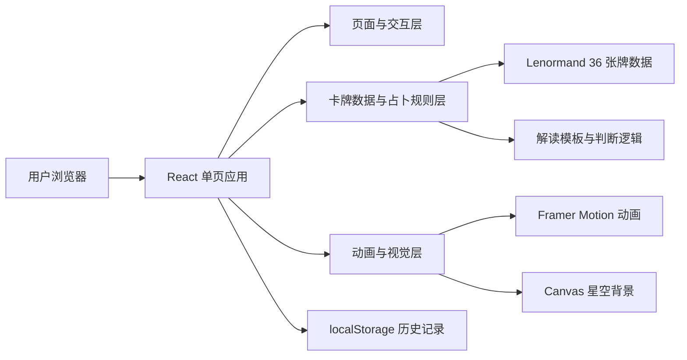

## 1. 架构设计
本项目采用纯前端单页架构，不设置后端服务。核心由 React 18 驱动界面渲染，Framer Motion 管理动效编排，CSS 负责主题与响应式样式组织，Canvas 2D 独立负责深空星空背景动画，本地牌组数据与占卜记录保存在浏览器内存 / `localStorage` 中。



## 2. 技术说明
- **前端框架**：React 18
- **构建工具**：Vite
- **样式方案**：原生 CSS（集中在 `src/index.css`）
- **动画方案**：Framer Motion
- **背景渲染**：HTML5 Canvas 2D
- **状态管理**：React `useState` + `useMemo` + `useEffect`
- **数据存储**：本地常量数据 + `localStorage`
- **开发语言**：JavaScript + JSX
- **部署形态**：纯静态站点，可直接部署到 Vercel / Netlify / Cloudflare Pages

## 3. 路由定义
项目采用单页应用结构，建议仅保留一个主路由：

| 路由 | 用途 |
|------|------|
| `/` | 网站主页面，包含首页入口与四种占卜模式切换 |

说明：四种占卜模式通过应用内状态切换，不新增多页面路由，以保持沉浸式体验与切换流畅度。

## 4. 前端模块划分
| 模块名称 | 职责 |
|-----------|------|
| `App.jsx` | 应用根组件，负责页面切换、全局状态与背景叠层 |
| `components/StarryBackground.jsx` | 渲染动态星空、闪烁星点与流星效果，负责清理动画帧 |
| `components/Card.jsx` | 单张卡牌组件，支持背面、正面、3D 翻转与不同断点尺寸 |
| `components/CardDeck.jsx` | 牌堆展示、洗牌动画、飞牌过渡 |
| `components/GlassCard.jsx` | 通用玻璃拟态容器 |
| `components/ReadingLayout.jsx` | 各占卜页面的共用标题、返回、重抽和内容布局 |
| `pages/Home.jsx` | 首页标题区与四个功能入口 |
| `pages/DailyLuck.jsx` | 今日运势模式逻辑与结果展示 |
| `pages/YesNo.jsx` | 是 / 否占卜模式逻辑与组合判断 |
| `pages/EitherOr.jsx` | 二选一模式逻辑与双侧牌阵对比 |
| `pages/Trend.jsx` | 过去 / 现在 / 未来趋势模式逻辑 |
| `data/lenormandCards.js` | 36 张牌数据定义 |
| `data/interpretations.js` | 中文模板文案、位置解释与结果描述片段 |
| `hooks/useShuffle.js` | 洗牌、抽牌与发牌顺序逻辑 |
| `hooks/useLocalStorage.js` | 占卜历史的读取、写入和清空封装 |

## 5. 数据定义

### 5.1 卡牌数据结构
```js
{
  id: 1,
  name: '骑手',
  nameEn: 'Rider',
  keywords: ['消息', '到来', '机会'],
  meaning: '新的讯息和变化正朝你靠近，事情有望快速推进。',
  symbol: '✧',
  polarity: 'positive'
}
```

### 5.2 占卜结果结构
```js
{
  mode: 'daily',
  title: '今日运势',
  resultLabel: '今日星讯',
  summary: '今日骑手出现，意味着新的讯息和变化正朝你靠近。',
  details: ['牌义细节一', '牌义细节二'],
  cards: []
}
```

## 6. 核心逻辑设计

### 6.1 洗牌与抽牌
- 从完整 36 张牌组复制出新数组，使用 Fisher-Yates 算法进行随机洗牌。
- 按模式要求截取前 N 张牌作为结果。
- 保证同一次占卜内不重复抽取同一张牌。

### 6.2 今日运势解读
- 使用单牌的 `name`、`keywords`、`meaning` 拼接模板文案。
- 可额外加入随机句式池，避免文案完全重复。

### 6.3 是 / 否占卜判断
- 为每张牌设置 `polarity`。
- 根据两张牌的倾向计分：
  - `positive` = `+1`
  - `neutral` = `0`
  - `negative` = `-1`
- 总分大于 0：偏 Yes
- 总分小于 0：偏 No
- 总分等于 0：结果中性，结合关键词与强势牌进行补充说明
- 对“太阳 / 钥匙 / 星星 / 棺材 / 山 / 十字架”等高权重牌可增加附加判断权重

### 6.4 二选一建议
- A/B 各自抽取 3 张牌，分别累计倾向分数。
- 比较双方总分、正向牌数量和阻碍牌数量。
- 若分差显著，则直接给出建议倾向。
- 若分数接近，则提示“两者都可行，但需结合现实条件进一步观察”。

### 6.5 时间线总结
- 为过去 / 现在 / 未来设置位置模板：
  - 过去：说明前因或已形成的影响
  - 现在：说明当前所处状态
  - 未来：说明后续趋势或提醒
- 将三张牌的解释拼接为时间线式总结文案。

### 6.6 本地历史记录
- 使用 `useLocalStorage.js` 将最近占卜结果写入本地。
- 最多保留最近 20 条记录。
- 读取失败时自动回退为空数组。

## 7. 动画与交互架构
| 动效对象 | 实现方式 | 说明 |
|-----------|-----------|------|
| 页面模式切换 | `AnimatePresence` + `motion.div` | 首页与功能视图之间淡入淡出 |
| 功能入口卡片 | `whileHover` / `whileTap` | 上浮、发光、轻微缩放反馈 |
| 洗牌动画 | `motion.div` 列表 + 旋转 / 位移编排 | 实现扇形展开与收拢 |
| 飞牌动画 | `layoutId` 或独立位移动画 | 卡牌从牌堆移动至目标区域 |
| 翻牌动画 | CSS 3D + 状态切换类名 | 保证正反面真实翻转感 |
| 解读文案 | Framer Motion stagger | 分段淡入增强仪式感 |
| 星空背景 | `requestAnimationFrame` | 高性能持续渲染，组件卸载时取消动画帧并移除监听 |

## 8. 样式系统设计

### 8.1 样式策略
- 所有视觉令牌集中在 `src/index.css` 中维护。
- 使用 CSS 变量定义主背景、强调色、边框色、阴影与卡牌尺寸。
- 卡牌尺寸通过媒体查询控制：
  - 桌面：`120px x 200px`
  - 平板：`100px x 170px`
  - 手机：`90px x 150px`
- 首页入口在手机端保持 `2x2` 网格。
- `Trend.jsx` 在手机端切换为纵向牌阵。

### 8.2 字体加载
- 标题字体：`Cinzel`
- 正文字体：`Inter`
- 通过 Google Fonts 或 `@import` / `<link>` 方式引入

## 9. 本地存储设计
本地历史使用如下键名：

```js
const STORAGE_KEY = 'lenormand-history';
```

存储策略：
- 最多保留最近 20 条记录
- 新记录插入数组头部
- 读取失败时回退为空数组
- 提供清空历史入口

## 10. 建议文件结构
```text
ui/
  ├─ index.html
  ├─ package.json
  ├─ vite.config.js
  ├─ public/
  │  └─ favicon.svg
  ├─ src/
  │  ├─ main.jsx
  │  ├─ App.jsx
  │  ├─ index.css
  │  ├─ components/
  │  │  ├─ StarryBackground.jsx
  │  │  ├─ Card.jsx
  │  │  ├─ CardDeck.jsx
  │  │  ├─ GlassCard.jsx
  │  │  └─ ReadingLayout.jsx
  │  ├─ pages/
  │  │  ├─ Home.jsx
  │  │  ├─ DailyLuck.jsx
  │  │  ├─ YesNo.jsx
  │  │  ├─ EitherOr.jsx
  │  │  └─ Trend.jsx
  │  ├─ data/
  │  │  ├─ lenormandCards.js
  │  │  └─ interpretations.js
  │  └─ hooks/
  │     ├─ useShuffle.js
  │     └─ useLocalStorage.js
  └─ .trae/
     └─ documents/
        ├─ 星语雷诺曼-产品需求文档.md
        └─ 星语雷诺曼-技术架构文档.md
```

## 11. 性能与可用性要求
- 星空背景在普通笔记本环境下保持流畅，控制粒子数量与流星频率。
- 减少不必要重渲染，卡牌列表与结果文本可使用 `useMemo` 优化。
- 表单必须有基础校验与空态提示。
- 动画应支持快速重复开始，避免因状态残留导致界面错乱。
- 颜色对比度需保证主要文字可读性。
- 所有用户可见文案必须为中文，代码注释统一使用中文。
- 卡牌与装饰元素不得依赖外部图片资源。

## 12. 测试与验收建议
- 验证四种占卜模式均可独立运行。
- 验证 36 张牌数据完整，且同一次抽牌无重复。
- 验证桌面 / 平板 / 手机三档尺寸下卡牌大小符合要求。
- 验证手机端首页入口为 2x2 网格，趋势牌阵为纵向排列。
- 验证移动端下卡牌尺寸、输入框、按钮点击区域正常。
- 验证刷新后历史记录仍可读取。
- 验证连续快速切换模式不会引发动画与状态异常。
